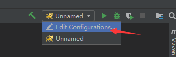
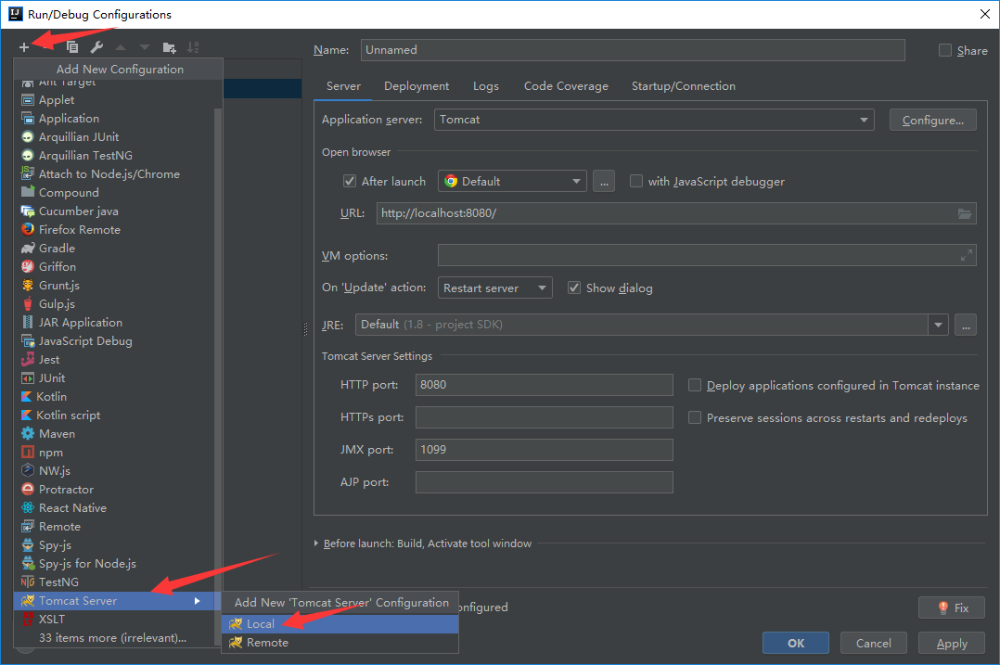
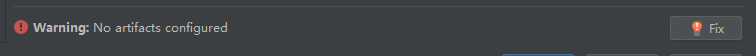
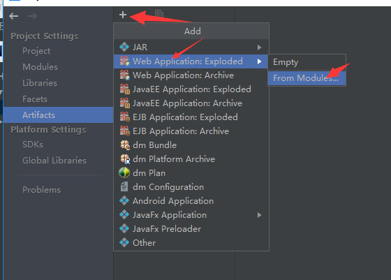
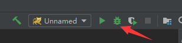
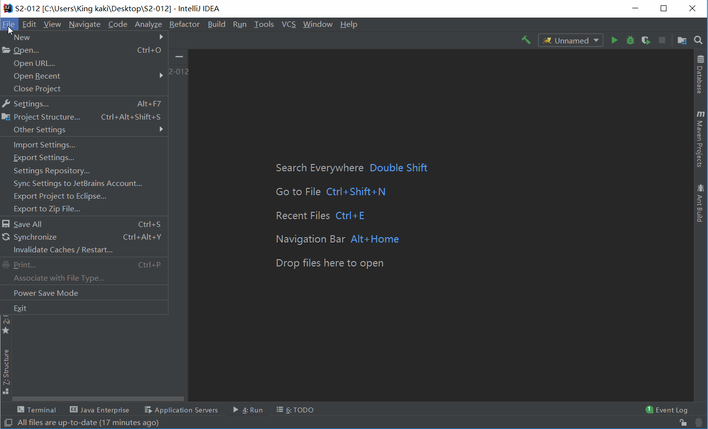

# Struts2-Vulenv
struts2 漏洞环境源代码，主要是自己学习struts2漏洞所用，方便debug溯源

还在不断更新中。。

- S2-001  [从零开始学习struts2漏洞 S2-001](https://xz.aliyun.com/t/2672)
- S2-007 [【Struts2-命令-代码执行漏洞分析系列】S2-007](https://xz.aliyun.com/t/2684)
- S2-008  [【Struts2-命令-代码执行漏洞分析系列】 S2-008 & S2-009 ](http://www.kingkk.com/2018/09/Struts2-命令-代码执行漏洞分析系列-S2-008-S2-009/)
- S2-009  [【Struts2-命令-代码执行漏洞分析系列】 S2-008 & S2-009 ](http://www.kingkk.com/2018/09/Struts2-命令-代码执行漏洞分析系列-S2-008-S2-009/)
- S2-012  [【Struts2-命令-代码执行漏洞分析系列】S2-012 ](http://www.kingkk.com/2018/09/Struts2-命令-代码执行漏洞分析系列-S2-012/)
- S2-013  [【Struts2-命令-代码执行漏洞分析系列】S2-013 & S2-014](https://xz.aliyun.com/t/2694)
- S2-014 [【Struts2-命令-代码执行漏洞分析系列】S2-013 & S2-014](https://xz.aliyun.com/t/2694)

# 使用方法

在IDEA中点击`File->New->Project from Existing Source `选中所需的`S2-0xx`文件夹，之后应该就是一路next

简单配置一下Configuration

Application server选择Tomcat目录，已经JRE对应版本

右下方有个warning，点击一下fix

如图所示添加一个Artifacts即可，然后就可以点击右上角的小虫子运行愉快的debug了

做了个简单的gif

